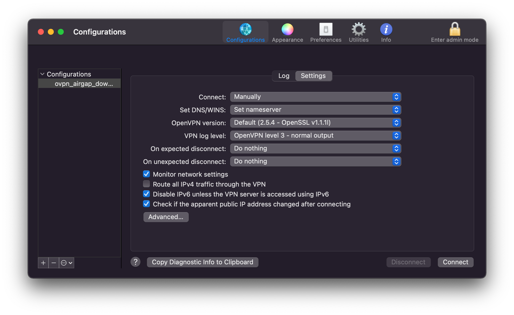
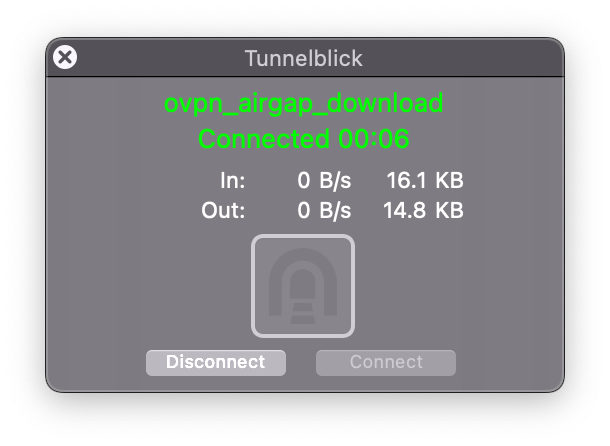
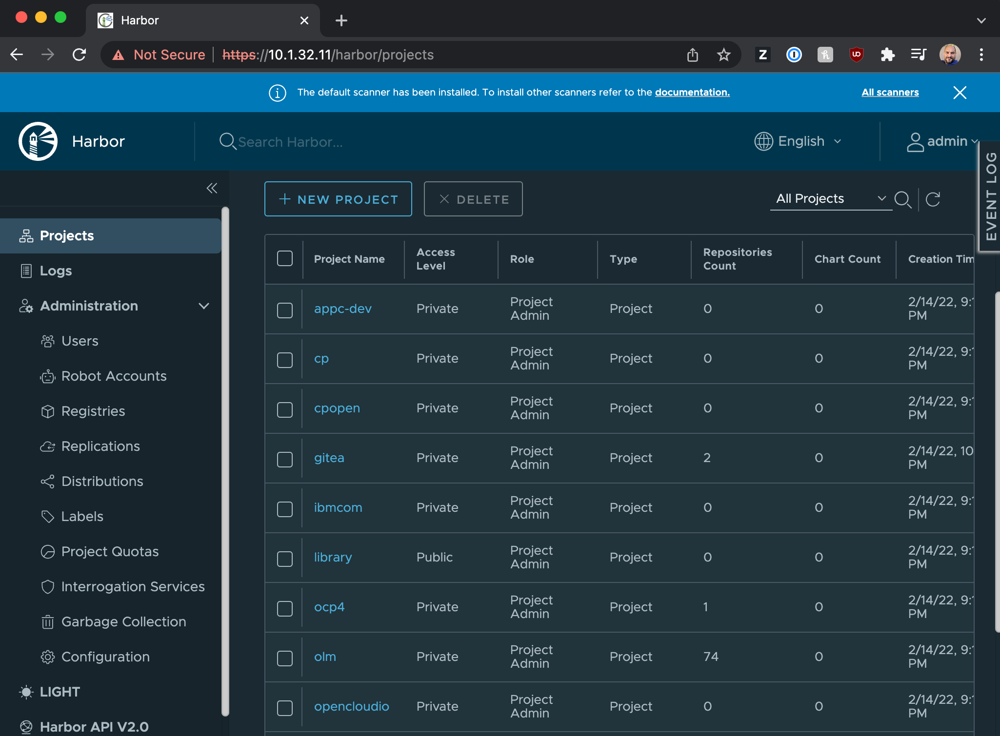
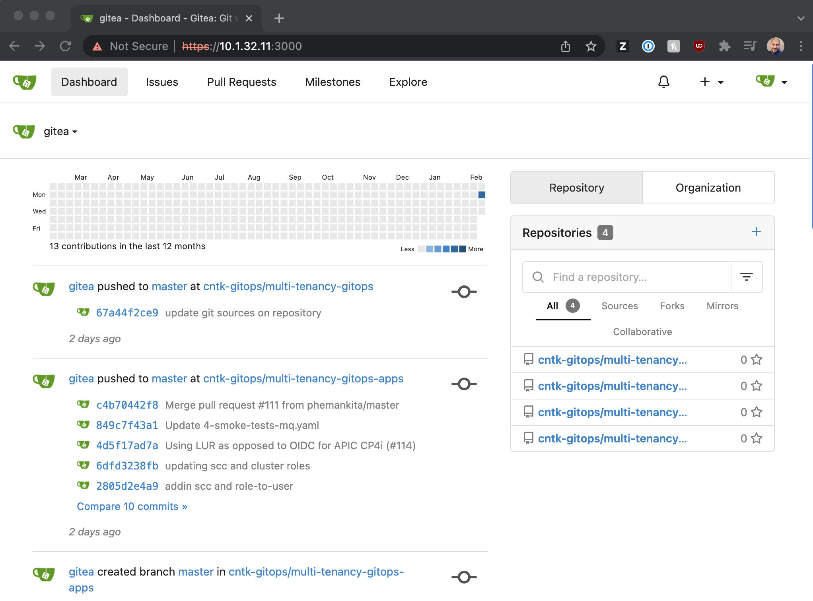
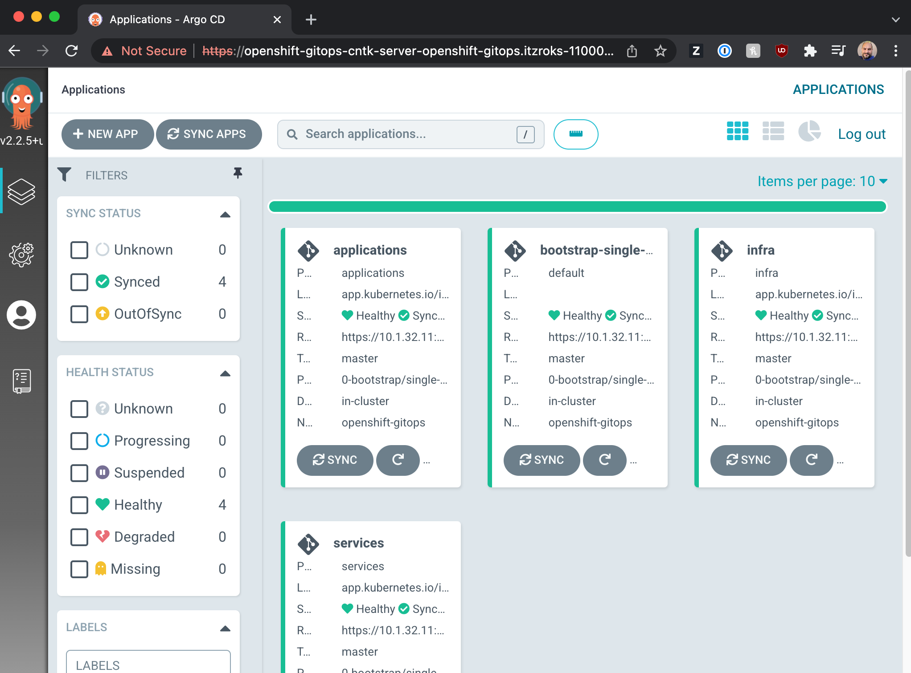
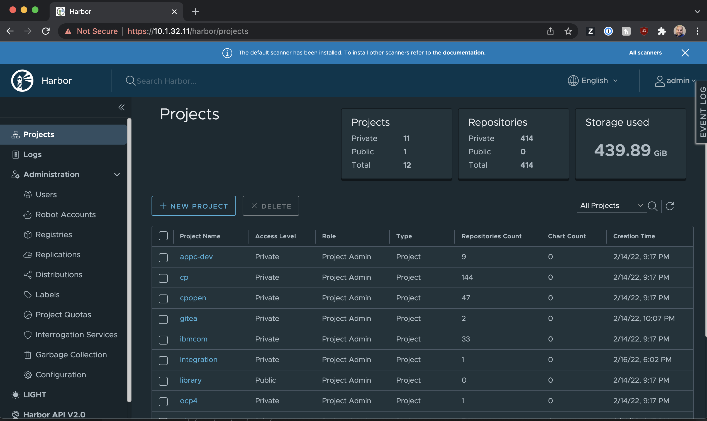

# IBM Cloud AirGapped Cluster with GitOps Configuration Tutorial

The IBM Go To Market Assets and Architecture team has developed automation that will allow you to deploy an AirGapped Cluster with Gitops Configuration in [TechZone](https://techzone.ibm.com/collection/production-deployment-guides#tab-6) based on the principles outlined in our [Cloud Pak Production Deployment Guides](https://production-gitops.dev/infrastructure/restricted-networks/).

## Reference Architecture


---

Leveraging a pre-existing [IBM Cloud VPC Network](https://cloud.ibm.com/docs/vpc), this automation deploys a Bastion Host into a subnet with a public gateway, and a Private Image Registry into a subnet with no outbound access.  The only traffic allowed between the two subnets is SSH and HTTPS traffic.

On the Bastion Host, a 1TB disk is mounted in /data for any post-deployment activities you may need to perform.  Although SSH access from the bastion server to the image registry server is allowed, we encourage you not to SSH into the image server directly, as this would not mimic a production environment.

On the Registry Server, we deploy [Harbor](https://goharbor.io/) to provide the private registry, and [Gitea](https://gitea.io/) to provide a private Github repository, prepopulated with the [Multi-Tenancy Gitops Framework](https://github.com/cloud-native-toolkit/multi-tenancy-gitops) from the [Cloud Native Toolkit](https://cloudnativetoolkit.dev/).

Finally, an OpenShift cluster is deployed into another set of subnets with no public gateways, so the cluster will have no outbound access.

A VPN Server is deployed in each od the target regions to provide access to the OpenShift Cluster, as well as the UIs of the OpenShift Cluster, Image Registry and GitHub server.

## Getting an Environment

To create an instance of this AirGapped environment, head to the [Production Deployment Guides Collection](https://techzone.ibm.com/collection/production-deployment-guides) in TechZone, click on the `Try It - Get a GitOps Cluster` tab, and select the `IBM Cloud AirGapped Cluster with GitOps configuration` tile.

## Welcome Email

After the environment is deployed from TechZone, you will receive an email from TechZone with your environment details.  The email will include:

- Next Steps:  A link to this repository
- Bastion Host and Registry Host IP Addresses (Private and Public)
- Bastion Host SSH Key
- Image Registry Private IP Address
- Details of your OpenShift Cluster, with links to the IBM Cloud Cluster page
- Harbor URL and Login Credentials
- Gitea URL and Login Credentials
- ArgoCD URL and Login Credentials
- VPN Configuration to access the environment

Some fields in this email will be unformated.  You will be able to download the SSH Key and VPN Configuration by going to the [My Reservations](https://techzone.ibm.com/my/reservations) page in TechZone, clicking your provisioned environment, and clicking the `Download SSH Key` and `Download OpenVPN Config` buttons.

## 1. Connectivity

### 1.1 VPN

To access the multiple WebUIs deployed in this solution, a VPN Configuration is included in your welcome email. On a Mac, you can use [TunnelBlick](https://tunnelblick.net/) to connect.  On Windows or Linux, you may use [OpenVPN](https://openvpn.net/vpn-client/).

Go to the [My Reservations](https://techzone.ibm.com/my/reservations) page in TechZone, click your provisioned environment, and click the `Download VPN Config` button.
Open your VPN Client, and import the downloaded configuration.  

On Tunnelblick in your Mac, drag the downloaded ovpn_airgap_download file into the Configurations left hard pane.  Select `Only Me` when prompted to install configuration for all users, and enter your password.

Press `Connect` to establish a VPN connection to your environment. You should see a window with connection details.



You will npow be able to access the WebUI URLs referenced in your welcome email.

### 1.2 SSH Access

The bastion host is the only component in the environment with a public IP address.  It's an Ubuntu 20.04 server with a 1TB /data disk for any components you need to download.  It has `docker-ce` installed, `oc`, `skopeo` and `ibmcloud` cli utilities. You may SSH into it as the `ubuntu` user with the SSH key you received in the welcome email. Head to the  [My Reservations](https://techzone.ibm.com/my/reservations) page in TechZone, click your provisioned environment, and click the `Download SSH Key` button.  The Public IP Address of your Bastion Host can be found in your welcome email and in the [My Reservations](https://techzone.ibm.com/my/reservations) page.

```bash
$ chmod 400 ~/Downloads/pem_airgap_download.pem
$ ssh -i ~/Downloads/pem_airgap_download.pem ubuntu@150.240.66.31
The authenticity of host '150.240.66.31 (150.240.66.31)' can't be established.
ED25519 key fingerprint is SHA256:/KPi86xF4+TLOjVBmSsf+LCm6Vcm6jZHCKQeIL4HgtQ.
This key is not known by any other names
Are you sure you want to continue connecting (yes/no/[fingerprint])? yes
Warning: Permanently added '150.240.66.31' (ED25519) to the list of known hosts.
Welcome to Ubuntu 20.04.2 LTS (GNU/Linux 5.4.0-80-generic x86_64)

 * Documentation:  https://help.ubuntu.com
 * Management:     https://landscape.canonical.com
 * Support:        https://ubuntu.com/advantage

  System information as of Thu Feb 10 03:55:17 UTC 2022

  System load:  0.0               Processes:                179
  Usage of /:   4.7% of 96.75GB   Users logged in:          0
  Memory usage: 1%                IPv4 address for docker0: 172.17.0.1
  Swap usage:   0%                IPv4 address for ens3:    10.1.16.11


135 updates can be applied immediately.
64 of these updates are standard security updates.
To see these additional updates run: apt list --upgradable


Last login: Thu Feb 10 03:54:43 2022 from 24.171.197.170
ubuntu@itzroks-1100007b1r-zjxv3v58-bastion:~$
```

## 2. Harbor Image Registry

Harbor is pre-installed into the server on port 443 of the Bastion Host.  You can access the Harbor UI by clicking on the Harbor UI link in the welcome email.  Credentials are in the welcome email as well. ChartMuseum, a helm chart repository, is pre-installed into Harbor, as well as Trivy, a vulnerability scanner for your container images.

The most common registry namespaces are created, with `ocp4` prepopulated with the OpenShift Platform images, and `olm` used to host a limited subset of the OperatorHub Catalog Images (openshift-ocs, openshift-gitops, openshift-pipelines). Prepopulated into the `toolkit-charts` registry namespace are all the Helm charts offered by the [Cloud Native Toolkit](https://charts.cloudnativetoolkit.dev/).



A few common registry namespaces are preloaded within Harbor.  If your solution requires additional registry namespaces, or projects, you can create them by by clicking on the `NEW PROJECT` button. Consult the [Harbor documentation](https://goharbor.io/docs/2.3.0/) for additional information and instructions.

## 3. Gitea Repository

Gitea is also pre-installed into the Registry Server on port 3000.  It provides a Private Github Repository for your GitOps deployments.  A fork of the [Cloud Native Toolkit GitOps Framework](https://github.com/cloud-native-toolkit/multi-tenancy-gitops) (and -infra, -services, -apps) is deployed into the Gitea server under the `cntk-gitops` org.
The repos are also cloned on the Bastion Host under `/home/ubuntu/repositories` with the gitea git token already included in the repo configuration.



Consult the [Gitea documentation](https://docs.gitea.io/) for additional information and instructions.

## 4. OpenShift Cluster

Your welcome email also includes a link to the IBM Cloud ROKS Cluster page.  The default is a 4.8 cluster, but 4.7 is also an option. To access the cluster from command line, you can SSH into the bastion host. The cluster `kubeconfig` file is pre-loaded into `~/.kube/config`, with full cluster-admin access, so you can automatically execute `oc` commands without any futher configuration changes.

```bash
ubuntu@itzroks-1100007b1r-zjxv3v58-bastion:~$ oc get nodes
NAME          STATUS   ROLES           AGE    VERSION
10.1.0.31     Ready    master,worker   143m   v1.21.6+bb8d50a
10.1.0.32     Ready    master,worker   139m   v1.21.6+bb8d50a
10.1.128.17   Ready    master,worker   142m   v1.21.6+bb8d50a
10.1.128.18   Ready    master,worker   141m   v1.21.6+bb8d50a
10.1.64.17    Ready    master,worker   143m   v1.21.6+bb8d50a
10.1.64.18    Ready    master,worker   141m   v1.21.6+bb8d50a
```

### 4.1 OpenShift Container Storage

If your workloads require RWX storage classes, you can deploy OpenShift Data Foundation when deploying your cluster, which will provide `ocs-storagecluster-cephfs` for your shared storage needs.

```bash
ubuntu@itzroks-1100007b1r-zjxv3v58-bastion:~$ oc get sc
NAME                          PROVISIONER                             RECLAIMPOLICY  VOLUMEBINDINGMODE ALLOWVOLUMEEXPANSION   AGE
... OUTPUT OMMITED ...
ocs-storagecluster-ceph-rbd   openshift-storage.rbd.csi.ceph.com      Delete         Immediate         true                   38h
ocs-storagecluster-ceph-rgw   openshift-storage.ceph.rook.io/bucket   Delete         Immediate         false                  38h
ocs-storagecluster-cephfs     openshift-storage.cephfs.csi.ceph.com   Delete         Immediate         true                   38h
openshift-storage.noobaa.io   openshift-storage.noobaa.io/obc         Delete         Immediate         false                  37h
```

## 5. OpenShift GitOps Operator

We also deploy the OpenShift GitOps Operator on your cluster.  The URL and credentials are included in the welcome email.  We automatically deploy the 4 `ArgoCD Applications` for bootstrap,  infra, services and applications, each corresponding to the `cntk-gitops` repositories under `/home/ubuntu/repositories`.



### 5.1 Helm Charts and ArgoCD Applications considerations

Lets take a look at modifications needed to deploy an ArgoCD Application backed by an external Helm Charts. We're going to update the Console Notification banner for our cluster.

First, update `repositories/gitops-0-bootstrap/0-bootstrap/single-cluster/1-infra/kustomization.yaml` and uncomment the `- argocd/consolenotification.yaml` line.

```yaml
resources:
#- argocd/consolelink.yaml
- argocd/consolenotification.yaml
#- argocd/namespace-ibm-common-services.yaml
#- argocd/namespace-ci.yaml
#- argocd/namespace-dev.yaml
#- argocd/namespace-staging.yaml
#- argocd/namespace-prod.yaml
#- argocd/namespace-cloudpak.yaml
#- argocd/namespace-istio-system.yaml
#- argocd/namespace-openldap.yaml
#- argocd/namespace-sealed-secrets.yaml
#- argocd/namespace-tools.yaml
#- argocd/namespace-instana-agent.yaml
#- argocd/namespace-robot-shop.yaml
#- argocd/namespace-openshift-storage.yaml
#- argocd/namespace-spp.yaml
#- argocd/namespace-spp-velero.yaml
#- argocd/namespace-baas.yaml
#- argocd/serviceaccounts-tools.yaml
#- argocd/storage.yaml
#- argocd/infraconfig.yaml
#- argocd/machinesets.yaml
patches:
- target:
    group: argoproj.io
    kind: Application
    labelSelector: "gitops.tier.layer=infra"
  patch: |-
    - op: add
      path: /spec/source/repoURL
      value: https://10.1.32.11:3000/cntk-gitops/multi-tenancy-gitops-infra.git
    - op: add
      path: /spec/source/targetRevision
      value: master
```

Next, update `repositories/gitops-0-bootstrap/0-bootstrap/single-cluster/1-infra/argocd/consolenotification.yaml` with your own banner details.

Traditionally, at this point you would just `git push` your updates to your Github org and wait for ArgoCD to do its reconciliation. However, since this Application depends on an external Helm Chart, it will be unable to sync.

```bash
$ oc get applications -n openshift-gitops
NAME                       SYNC STATUS   HEALTH STATUS
applications               Synced        Healthy
bootstrap-single-cluster   Synced        Healthy
cntk-consolenotification   Unknown       Healthy ## Unknown Sync Status
infra                      Synced        Healthy
services                   Synced        Healthy
```

Upon inspection, note that ArgoCD is unable to reach the external helm repository

```bash
$ oc logs -n openshift-gitops openshift-gitops-cntk-repo-server-8588fb6df4-lfmkt -f
...OMMITED...
time="2022-02-10T14:22:31Z" level=error msg="finished unary call with code Unknown" error="`helm repo add https://cloud-native-toolkit.github.io/toolkit-charts/ https://cloud-native-toolkit.github.io/toolkit-charts/` failed exit status 1: Error: looks like \"https://cloud-native-toolkit.github.io/toolkit-charts/\" is not a valid chart repository or cannot be reached: Get \"https://cloud-native-toolkit.github.io/toolkit-charts/index.yaml\": dial tcp 185.199.108.153:443: connect: connection timed out" grpc.code=Unknown grpc.method=GenerateManifest grpc.request.deadline="2022-02-10T14:22:31Z" grpc.service=repository.RepoServerService grpc.start_time="2022-02-10T14:21:31Z" grpc.time_ms=60369.8 span.kind=server system=grpc
...OMMITED...
```

We need to update the consolenotification helm chart configuration in `repositories/gitops-1-infra/consolenotification/Chart.yaml` to point to the right repository.  In this environment, all Cloud Native Toolkit helm charts will be deployed under `https://$YOURREGISTRYPRIVATEIP/chartrepo/toolkit-charts`

```yaml
apiVersion: v2
name: ocp-console-notification
description: Chart to create a ConsoleNotification resource in an OpenShift cluster
type: application
version: 0.2.0
appVersion: 1.16.0
dependencies:
  - name: ocp-console-notification
    version: 0.2.0
    ## replace 10.1.32.11 with the Private IP Address of your registry server, see your welcome email.
    repository: https://10.1.32.11/chartrepo/toolkit-charts
```

Once synced back to Gitea, your applications will be in sync

```bash
$ oc get applications -n openshift-gitops
NAME                       SYNC STATUS   HEALTH STATUS
applications               Synced        Healthy
bootstrap-single-cluster   Synced        Healthy
cntk-consolenotification   Synced        Healthy
infra                      Synced        Healthy
services                   Synced        Healthy

$ oc get consolenotification
NAME         TEXT                               LOCATION    AGE
banner-env   IBM Cloud ROKS AriGapped Cluster   BannerTop   5m2s
```

## 6. ClouPak Deployments

Familiarize yourself with  your [CloudPak](https://www.ibm.com/docs/en/cloud-paks) AirGap deployment processes.  A cloudpak agnostic deployment model can be located in our Cloud Pak Production Deployment Guides [Restricted Networks](https://production-gitops.dev/infrastructure/restricted-networks/#mirroring-cloudpak-container-images) section.

At a high level, this model consists of the following steps:

- cloudctl case save
- cloudctl case launch --action configure-creds-airgap  # for your private registry
- cloudctl case launch --action configure-creds-airgap  # for cp.icr.io
- cloudctl case launch --action mirror-images
- cloudctl case launch --action configure-cluster-airgap
- cloudctl case launch --action install-catalog

Once the images are mirrored, follow the [Update imageContentSourcePolicy](#updating-image-content-source-policies) section to update your cluster nodes.

### 6.1 Sample CloudPak Deployment

#### 6.1.1 Save Case Bundles on Bastion Host

```bash
ubuntu@itzroks-1100007b1r-zjxv3v58-bastion:~$ export CASE_NAME=ibm-cp-integration
ubuntu@itzroks-1100007b1r-zjxv3v58-bastion:~$ export CASE_VERSION=2.5.0
ubuntu@itzroks-1100007b1r-zjxv3v58-bastion:~$ export CASE_INVENTORY_SETUP=operator
ubuntu@itzroks-1100007b1r-zjxv3v58-bastion:~$ export OFFLINEDIR=/data/artifacts/cloudpak
ubuntu@itzroks-1100007b1r-zjxv3v58-bastion:~$ export CASE_REPO_PATH=https://github.com/IBM/cloud-pak/raw/master/repo/case
ubuntu@itzroks-1100007b1r-zjxv3v58-bastion:~$
ubuntu@itzroks-1100007b1r-zjxv3v58-bastion:~$ mkdir $OFFLINEDIR
ubuntu@itzroks-1100007b1r-zjxv3v58-bastion:~$ cloudctl case save \
    --repo $CASE_REPO_PATH \
    --case $CASE_NAME \
    --version $CASE_VERSION \
    --outputdir $OFFLINEDIR
Downloading and extracting the CASE ...
- Success
Retrieving CASE version ...
- Success
Validating the CASE ...
[warn] - Validation warning found in inventory/operator/resources.yaml: Multiple media types specifed for single-platform images. The media types for images in a single resources.yaml should match. Found media types: [application/vnd.docker.distribution.manifest.v2 application/vnd.oci.image.manifest.v1]
Validating the signature for the ibm-cp-integration CASE...
- Success
Creating inventory ...
- Success
Finding inventory items
- Success
Resolving inventory items ...
Parsing inventory items
Validating the signature for the ibm-cp-common-services CASE...
Validating the signature for the ibm-auditlogging CASE...
Validating the signature for the ibm-cert-manager CASE...
Validating the signature for the ibm-cs-commonui CASE...
Validating the signature for the ibm-crossplane-bundle CASE...
Validating the signature for the ibm-events-operator CASE...
Validating the signature for the ibm-cs-healthcheck CASE...
Validating the signature for the ibm-cs-iam CASE...
Validating the signature for the ibm-cpp CASE...
Validating the signature for the ibm-zen CASE...
Validating the signature for the ibm-licensing CASE...
Validating the signature for the ibm-management-ingress CASE...
Validating the signature for the ibm-cs-mongodb CASE...
Validating the signature for the ibm-cs-monitoring CASE...
Validating the signature for the ibm-platform-api-operator CASE...
Validating the signature for the ibm-automation-foundation-core CASE...
Validating the signature for the ibm-datapower-operator CASE...
Validating the signature for the ibm-apiconnect CASE...
Validating the signature for the ibm-ai-wmltraining CASE...
Validating the signature for the ibm-appconnect CASE...
Validating the signature for the ibm-couchdb CASE...
Validating the signature for the ibm-aspera-hsts-operator CASE...
Validating the signature for the ibm-cloud-databases-redis CASE...
Validating the signature for the ibm-mq CASE...
Validating the signature for the ibm-integration-asset-repository CASE...
Validating the signature for the ibm-integration-platform-navigator CASE...
Validating the signature for the ibm-integration-operations-dashboard CASE...
Validating the signature for the ibm-eventstreams CASE...
- Success
```

#### 6.1.2 Configure Private Registry Credentials

On the welcome email, obtain your registry private ip address, as well as the harbor username and password.

```bash
ubuntu@itzroks-1100007b1r-zjxv3v58-bastion:~$ export LOCAL_REGISTRY=10.1.32.11
ubuntu@itzroks-1100007b1r-zjxv3v58-bastion:~$ export LOCAL_REGISTRY_USER=admin
ubuntu@itzroks-1100007b1r-zjxv3v58-bastion:~$ export LOCAL_REGISTRY_PASSWORD=k2cTppzgqF1UmOEs
ubuntu@itzroks-1100007b1r-zjxv3v58-bastion:~$ cloudctl case launch \
    --case $OFFLINEDIR/${CASE_NAME}-${CASE_VERSION}.tgz \
    --inventory $CASE_INVENTORY_SETUP \
    --action configure-creds-airgap \
    --args "--registry $LOCAL_REGISTRY --user $LOCAL_REGISTRY_USER --pass $LOCAL_REGISTRY_PASSWORD"
Welcome to the CASE launcher
Attempting to retrieve and extract the CASE from the specified location
[✓] CASE has been retrieved and extracted
Attempting to validate the CASE
[✓] CASE has been successfully validated
Attempting to locate the launch inventory item, script, and action in the specified CASE
[✓] Found the specified launch inventory item, action, and script for the CASE
Attempting to check the cluster and machine for required prerequisites for launching the item
Checking for required prereqs...
No requires section specified.
Required prereqs result: OK
Checking user permissions...
No user rules specified.
[✓] Cluster and Client Prerequisites have been met for the CASE
Running the CASE operator launch script with the following action context: configureCredsAirgap
oc: Client Version: 4.8.29
Executing inventory item operator, action configureCredsAirgap : launch.sh
-------------Configuring authentication secret-------------
[INFO] Creating registry authentication secret for 10.1.32.11
[INFO] Registry secret created in /home/ubuntu/.airgap/secrets/10.1.32.11.json
[INFO] Done
[✓] CASE launch script completed successfully
OK
ubuntu@itzroks-1100007b1r-zjxv3v58-bastion:~$
```

#### 6.1.3 Configure IBM Entitlement Registry Credentials

```bash
ubuntu@itzroks-1100007b1r-zjxv3v58-bastion:~$ export IBM_ENTITLEMENT_KEY="eyJ..."
ubuntu@itzroks-1100007b1r-zjxv3v58-bastion:~$ cloudctl case launch \
    --case $OFFLINEDIR/${CASE_NAME}-${CASE_VERSION}.tgz \
    --inventory $CASE_INVENTORY_SETUP \
    --action configure-creds-airgap \
    --args "--registry cp.icr.io --user cp --pass $IBM_ENTITLEMENT_KEY"
Welcome to the CASE launcher
Attempting to retrieve and extract the CASE from the specified location
[✓] CASE has been retrieved and extracted
Attempting to validate the CASE
[✓] CASE has been successfully validated
Attempting to locate the launch inventory item, script, and action in the specified CASE
[✓] Found the specified launch inventory item, action, and script for the CASE
Attempting to check the cluster and machine for required prerequisites for launching the item
Checking for required prereqs...
No requires section specified.
Required prereqs result: OK
Checking user permissions...
No user rules specified.
[✓] Cluster and Client Prerequisites have been met for the CASE
Running the CASE operator launch script with the following action context: configureCredsAirgap
oc: Client Version: 4.8.29
Executing inventory item operator, action configureCredsAirgap : launch.sh
-------------Configuring authentication secret-------------
[INFO] Creating registry authentication secret for cp.icr.io
[INFO] Registry secret created in /home/ubuntu/.airgap/secrets/cp.icr.io.json
[INFO] Done
[✓] CASE launch script completed successfully
OK
```

#### 6.1.4 Mirror CloudPak Images to Harbor Repository

Harbor doesn't create new registry namespaces automatically.  Consult your CloudPak documentation and create any registry namespaces that are required for your solution.  In this example, we're mirroring CP4I, which requires the `cp`,`cpopen`, `integration` and `opencloudio` registry namespaces.  Create any missing namespaces from the Harbor UI. Once done, you can proceed with the image mirroring process.

```bash
ubuntu@itzroks-1100007b1r-zjxv3v58-bastion:~$ cloudctl case launch \
    --case $OFFLINEDIR/${CASE_NAME}-${CASE_VERSION}.tgz \
    --inventory $CASE_INVENTORY_SETUP \
    --action mirror-images \
    --args "--registry $LOCAL_REGISTRY --inputDir $OFFLINEDIR --chunks 100"
Welcome to the CASE launcher
Attempting to retrieve and extract the CASE from the specified location
[✓] CASE has been retrieved and extracted
Attempting to validate the CASE
[✓] CASE has been successfully validated
Attempting to locate the launch inventory item, script, and action in the specified CASE
[✓] Found the specified launch inventory item, action, and script for the CASE
Attempting to check the cluster and machine for required prerequisites for launching the item
Checking for required prereqs...

Prerequisite                                 Result
Client has oc version 4.4.0 or greater       true
Client has skopeo version 0.1.41 or greater  true

Required prereqs result: OK
Checking user permissions...
No user rules specified.
[✓] Cluster and Client Prerequisites have been met for the CASE
Running the CASE operator launch script with the following action context: mirrorImages
oc: Client Version: 4.8.29
Executing inventory item operator, action mirrorImages : launch.sh
-------------Mirroring images-------------
[INFO] Generating auth.json
[INFO] Processing CASE archive directory: /data/artifacts/cloudpak

...OUTPUT OMITTED...

info: Planning completed in 70ms
sha256:8235c2877bb294e2efb90b691b9ee36310a3cccb71c13cac00eaca63bc27b75a 10.1.32.11/cpopen/ibm-integration-platform-navigator-catalog
sha256:ad8ed89d7724da8e93f006afc1b8eb06315633135e585630b08df104e6aa145e 10.1.32.11/cpopen/ibm-integration-platform-navigator-catalog
sha256:f597f29c7a2f0ca3833f9ae5c9df5b0bea999ed6d3e61d94400e1fe388d2e2d2 10.1.32.11/cpopen/ibm-integration-platform-navigator-catalog
sha256:6b01d90c3d7cc4e3c7060463224a224ca83b029e052043df2da3d0e0f4ebd83e 10.1.32.11/cpopen/ibm-integration-platform-navigator-catalog:latest
info: Mirroring completed in 70ms (0B/s)
[✓] CASE launch script completed successfully
OK
```

If you get an error while mirroring similar to

```text
error: unable to push quay.io/opencloudio/icp4data-nginx-repo: failed to upload blob
sha256:d15edd54cb42b8e220f31259a0e16ab2dc5790543ff58c57c9dd24cf7e597c70: error parsing
HTTP 400 response body: invalid character '<' looking for beginning of value: 
"<html>\r\n<head><title>400 Request Header Or Cookie Too Large
</title></head>\r\n<body>\r\n<center><h1>400 Bad Request</h1></center>\r\n<center>
Request Header Or Cookie Too Large</center>\r\n<hr><center>nginx</center>\r\n</body>
\r\n</html>\r\n"
```

rerun the mirror command with `--chunks 50`

Once completed, head to the Harbor UI to validate images have been uploaded.



#### 6.1.5 Create Image Content Source Policies

Next, we will create the `ImageContentSourcePolicy` objects that allow us to transparently redirect external image references to our internal repositories.  Due to a limitation in ROKS, we need to include the `--dryRun` parameter to obtain the yaml files needed, and manually update the node registries.

```bash
ubuntu@itzroks-1100007b1r-zjxv3v58-bastion:~$ export NAMESPACE=cp4i
ubuntu@itzroks-1100007b1r-zjxv3v58-bastion:~$ oc new-project $NAMESPACE
Now using project "cp4i" on server "https://c117-e.private.us-south.containers.cloud.ibm.com:31017".

You can add applications to this project with the 'new-app' command. For example, try:

    oc new-app rails-postgresql-example

to build a new example application in Ruby. Or use kubectl to deploy a simple Kubernetes application:

    kubectl create deployment hello-node --image=k8s.gcr.io/serve_hostname
ubuntu@itzroks-1100007b1r-zjxv3v58-bastion:~$ cloudctl case launch \
    --case $OFFLINEDIR/${CASE_NAME}-${CASE_VERSION}.tgz \
    --inventory $CASE_INVENTORY_SETUP \
    --action configure-cluster-airgap \
    --namespace $NAMESPACE \
    --args "--registry $LOCAL_REGISTRY --user $LOCAL_REGISTRY_USER --pass $LOCAL_REGISTRY_PASSWORD --inputDir $OFFLINEDIR --dryRun"
Welcome to the CASE launcher
Attempting to retrieve and extract the CASE from the specified location
[✓] CASE has been retrieved and extracted
Attempting to validate the CASE
[✓] CASE has been successfully validated
Attempting to locate the launch inventory item, script, and action in the specified CASE
[✓] Found the specified launch inventory item, action, and script for the CASE
Attempting to check the cluster and machine for required prerequisites for launching the item
Checking for required prereqs...

Prerequisite                                                          Result
Kubernetes version is 1.17.1 or greater                               true
OpenShift Container Platform Kubernetes version is 1.17.1 or greater  true
Cluster has at least one amd64/s390x node                             true

... OUTPUT OMITTED ...

[INFO] Generating image content source policy
---
apiVersion: operator.openshift.io/v1alpha1
kind: ImageContentSourcePolicy
metadata:
  name: ibm-cp-integration
spec:
  repositoryDigestMirrors:
  - mirrors:
    - 10.1.32.11/cp
    source: cp.icr.io/cp
  - mirrors:
    - 10.1.32.11/ibmcom
    source: docker.io/ibmcom
  - mirrors:
    - 10.1.32.11/appc-dev
    source: icr.io/appc-dev
  - mirrors:
    - 10.1.32.11/cpopen
    source: icr.io/cpopen
  - mirrors:
    - 10.1.32.11/integration
    source: icr.io/integration
  - mirrors:
    - 10.1.32.11/opencloudio
    source: quay.io/opencloudio
---
[INFO] Applying image content source policy
oc apply --dry-run=client -f "/tmp/airgap_image_policy_zJwCrj3GE"
imagecontentsourcepolicy.operator.openshift.io/ibm-cp-integration created (dry run)
[✓] CASE launch script completed successfully
OK
ubuntu@itzroks-1100007b1r-zjxv3v58-bastion:~$
```

If your customer is not running ROKS, then you can run `oc apply -f "/tmp/airgap_image_policy_zJwCrj3GE"`

In ROKS, you need to manually update the nodes.  To do so, for each mirror in `spec.repositoryDigestMirrors` in the list above, create the following snippet.  

```text
[[registry]]
  location = "cp.icr.io/cp"  # << this is the mirror source
  insecure = false
  blocked = false
  mirror-by-digest-only = false
  prefix = ""

  [[registry.mirror]]
  location = "10.1.32.11/cp" # << this points to our internal registry
  insecure = false
```

Then, SSH into each worker node, manually append each `[[registry]]` stanza into /etc/containers/registries.conf, and restart crio with `kill -9 $(pgrep crio)`

The following helper script can automate this task.  It leverages a special DaemonSet created for this environment in the `kube-system` namespace that will update the registry configuration for you without the need of replacing the OpenShift node.  Run the following from your bastion host

```bash
ubuntu@itzroks-1100007b1r-zjxv3v58-bastion:~$ sudo wget -qO /usr/local/bin/yq https://github.com/mikefarah/yq/releases/latest/download/yq_linux_amd64

ubuntu@itzroks-1100007b1r-zjxv3v58-bastion:~$ for source in $(cat /tmp/airgap_image_policy_zJwCrj3GE |yq -r '.spec.repositoryDigestMirrors[] .source');do
    mirror=$(cat /tmp/airgap_image_policy_zJwCrj3GE |yq -r --arg source "$source" '.spec.repositoryDigestMirrors[] | select(.source == $source )| .mirrors[0]')
    echo "$source=$mirror"
done >> $HOME/manifests-redhat-operator-index/mapping.txt

ubuntu@itzroks-1100007b1r-zjxv3v58-bastion:~$ oc create secret generic -n kube-system registry-mapping --from-file=mapping.txt=$HOME/manifests-redhat-operator-index/mapping.txt --dry-run=client -o yaml|oc apply -f -
ubuntu@itzroks-1100007b1r-zjxv3v58-bastion:~$
```

### 6.1.6 Create CloudPak Catalog Sources

To create the `CatalogSources` for your CloudPak, run the following command

```bash
ubuntu@itzroks-1100007b1r-zjxv3v58-bastion:~$ cloudctl case launch \
  --case $OFFLINEDIR/${CASE_NAME}-${CASE_VERSION}.tgz \
  --inventory ${CASE_INVENTORY_SETUP} \
  --action install-catalog \
  --namespace ${NAMESPACE} \
  --args "--registry ${LOCAL_REGISTRY} --inputDir $OFFLINEDIR --recursive"
  
  ... OUTPUT OMITTED ...
  -------------Installing catalog source-------------
# Will need to register the image name at cp.icr.io/cp/<image>, as the content clusters
# won't add the cp4i mapping for us.
apiVersion: operators.coreos.com/v1alpha1
kind: CatalogSource
metadata:
  name: ibm-cp-integration-catalog
  namespace: openshift-marketplace
spec:
  displayName: IBM Cloud Pak for Integration
  publisher: IBM
  sourceType: grpc
  image: 10.1.32.11/cpopen/ibm-cp-integration-catalog:1.5.0-2021-11-29-1811-9245e842@sha256:a566d62b945f31da1a2963d0917c0d50e62370ddfcb67616706a810a0328e423
catalogsource.operators.coreos.com/ibm-cp-integration-catalog created
done
[✓] CASE launch script completed successfully
OK
ubuntu@itzroks-1100007b1r-zjxv3v58-bastion:~$
```

To validate that the `CatalogSources` we first check that they're properly created, and then check that its associated pod is in a `Running` state.

```bash
ubuntu@itzroks-1100007b1r-zjxv3v58-bastion:~$ oc get catalogsources -A
NAMESPACE               NAME                                           DISPLAY                                      TYPE   PUBLISHER     AGE
openshift-marketplace   appconnect-operator-catalogsource              IBM App Connect operator                     grpc   IBM           118s
openshift-marketplace   aspera-operators                               Aspera Operators                             grpc   IBM           112s
openshift-marketplace   couchdb-operator-catalog                       Couchdb Operator Catalog                     grpc   IBM           2m4s
openshift-marketplace   ibm-ai-wmltraining-operator-catalog            WML Core Training                            grpc   IBM           2m14s
openshift-marketplace   ibm-apiconnect-catalog                         IBM APIConnect catalog                       grpc   IBM           2m13s
openshift-marketplace   ibm-automation-foundation-core-catalog         IBM Automation Foundation Core Operators     grpc   IBM           2m25s
openshift-marketplace   ibm-cloud-databases-redis-operator-catalog     ibm-cloud-databases-redis-operator-catalog   grpc   IBM           113s
openshift-marketplace   ibm-cp-integration-catalog                     IBM Cloud Pak for Integration                grpc   IBM           79s
openshift-marketplace   ibm-datapower-operator-catalog                 DataPower Operator                           grpc   IBM Content   2m18s
openshift-marketplace   ibm-eventstreams                               Event Streams Operators                      grpc   IBM           107s
openshift-marketplace   ibm-integration-asset-repository-catalog       IBM CP4I Asset Repository                    grpc   IBM           91s
openshift-marketplace   ibm-integration-operations-dashboard-catalog   IBM CP4I Operations Dashboard                grpc   IBM           81s
openshift-marketplace   ibm-integration-platform-navigator-catalog     IBM CP4I Platform Navigator                  grpc   IBM           84s
openshift-marketplace   ibmmq-operator-catalogsource                   IBM MQ                                       grpc   IBM           102s
openshift-marketplace   opencloud-operators                            IBMCS Operators                              grpc   IBM           2m
openshift-marketplace   redhat-operators                                                                            grpc                 2d15h

ubuntu@itzroks-1100007b1r-zjxv3v58-bastion:~$ oc get pods -n openshift-marketplace
NAME                                                              READY   STATUS      RESTARTS   AGE
03f75cd3603a69b73a44a94a27ab695c89a42b9f33bb16dc454676fa21k2j2t   0/1     Completed   0          2d15h
6b508d7f387428ad1e89cdc055963435dea54c53785656140d165dc729rbpc9   0/1     Completed   0          2d15h
88d6b59edf41a794c19a5d1bc2d68c216f34a063feed6890448ca55b2f95wjw   0/1     Completed   0          2d15h
appconnect-operator-catalogsource-vnjbb                           1/1     Running     0          2m12s
aspera-operators-frs2l                                            1/1     Running     0          2m5s
couchdb-operator-catalog-lck7t                                    1/1     Running     0          2m18s
ibm-ai-wmltraining-operator-catalog-s6lrx                         1/1     Running     0          2m30s
ibm-apiconnect-catalog-7phnf                                      1/1     Running     0          2m28s
ibm-automation-foundation-core-catalog-szvpv                      1/1     Running     0          2m41s
ibm-cloud-databases-redis-operator-catalog-qvmwg                  1/1     Running     0          2m6s
ibm-cp-integration-catalog-jlqhn                                  1/1     Running     0          89s
ibm-datapower-operator-catalog-8qc58                              1/1     Running     0          2m34s
ibm-eventstreams-5bz94                                            1/1     Running     0          2m
ibm-integration-asset-repository-catalog-h798c                    1/1     Running     0          103s
ibm-integration-operations-dashboard-catalog-b6q7m                1/1     Running     0          92s
ibm-integration-platform-navigator-catalog-7nfj8                  1/1     Running     0          95s
ibmmq-operator-catalogsource-wmzqq                                1/1     Running     0          115s
marketplace-operator-66c666bf74-jcgn5                             1/1     Running     0          2d16h
opencloud-operators-5lw8x                                         1/1     Running     0          2m14s
redhat-operators-8xgvw                                            1/1     Running     0          2d15h
```

## Pushing External Images to your Private Image Registry

To add any additional images you may need into your registry, you can use the `skopeo` utility from the Bastion Host.  First logon to both source and private registry with skopeo, then use `skopeo copy` to copy the images

```bash
ubuntu@itzroks-1100007b1r-zjxv3v58-bastion:~/$ skopeo login docker.io                                                        
Username: yourusername
Password: 
Login Succeeded!
ubuntu@itzroks-1100007b1r-zjxv3v58-bastion:~/$ skopeo login 10.1.32.11
Username: admin
Password:
Login Succeeded!
ubuntu@itzroks-1100007b1r-zjxv3v58-bastion:~/$ skopeo copy docker://docker.io/hello-world:latest docker://10.1.32.11/ocp4/hello-world:latest
Getting image source signatures
Copying blob 2db29710123e done
Copying config feb5d9fea6 done
Writing manifest to image destination
Storing signatures
ubuntu@itzroks-1100007b1r-zjxv3v58-bastion:~$ skopeo copy docker://docker.io/hello-world:latest docker://10.1.32.11/ocp4/hello-world:latest
Getting image source signatures
Copying blob 2db29710123e done
Copying config feb5d9fea6 done
Writing manifest to image destination
Storing signatures
ubuntu@itzroks-1100007b1r-zjxv3v58-bastion:~$ podman login 10.1.32.11 -u admin -p $LOCAL_REGISTRY_PASSWORD
Login Succeeded!
ubuntu@itzroks-1100007b1r-zjxv3v58-bastion:~$ podman run 10.1.32.11/ocp4/hello-world:latest
Trying to pull 10.1.32.11/ocp4/hello-world:latest...
Getting image source signatures
Copying blob 2db29710123e done
Copying config feb5d9fea6 done
Writing manifest to image destination
Storing signatures

Hello from Docker!
This message shows that your installation appears to be working correctly.

To generate this message, Docker took the following steps:
 1. The Docker client contacted the Docker daemon.
 2. The Docker daemon pulled the "hello-world" image from the Docker Hub.
    (amd64)
 3. The Docker daemon created a new container from that image which runs the
    executable that produces the output you are currently reading.
 4. The Docker daemon streamed that output to the Docker client, which sent it
    to your terminal.

To try something more ambitious, you can run an Ubuntu container with:
 $ docker run -it ubuntu bash

Share images, automate workflows, and more with a free Docker ID:
 https://hub.docker.com/

For more examples and ideas, visit:
 https://docs.docker.com/get-started/

ubuntu@itzroks-1100007b1r-zjxv3v58-bastion:~$
```
